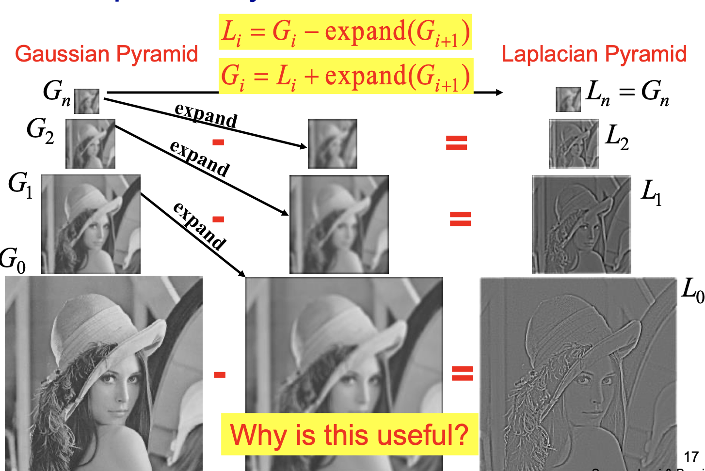

## Implementation Laplacian Loss in Pytorch

Building Laplacian Pyramid using `EXPAND` operator. The `PyrUp` operator is implemented by `torch.nn.functional.conv_transpose2d`. The `PyrDown` operator is implemented by `torch.nn.functional.conv2d` using gaussian kernel.

