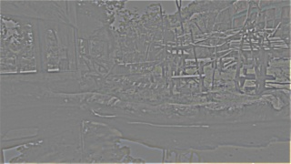

## Implementation of Laplacian Loss in Pytorch

Building Laplacian Pyramid using `EXPAND` operator. The `PyrUp` operator is implemented by `torch.nn.functional.conv_transpose2d`. The `PyrDown` operator is implemented by `torch.nn.functional.conv2d` using gaussian kernel.

### Comparison with OpenCV-implementation

| scale | pytorch-implementation | opencv-implementation |
| ---- | ---- | ---- |
|input|  |  |
|0|  |  |
|1|  |  |
|2|  |  |
|3|  |  |